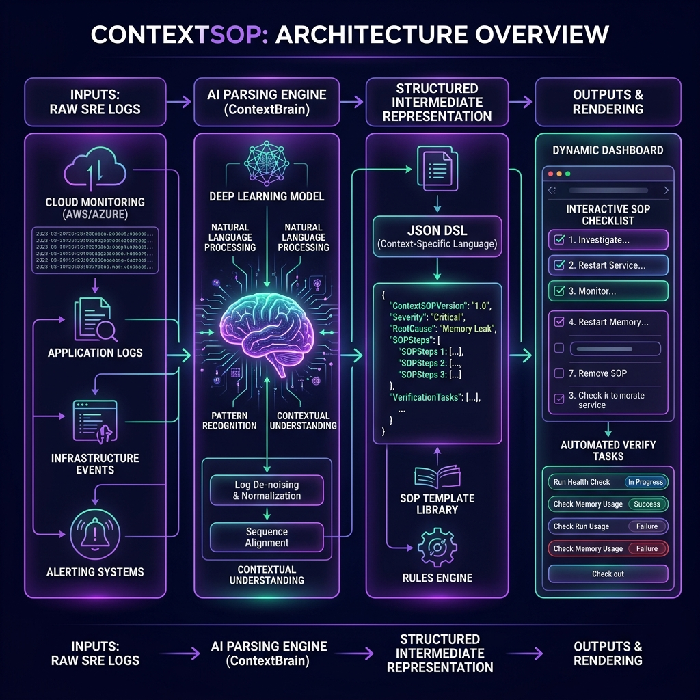

# ContextSOP

<p align="center">
  
</p>

ContextSOP transforms raw, unstructured, and chaotic engineering logs, postmortem logs, and Slack incident transcripts into **safe, stateful, and interactive Standard Operating Procedures (SOPs)**. By combining generative AI context parsing (GPT-4o) with a strict, declarative JSON-based Workflow DSL, ContextSOP eliminates manual runbook updates, parameterizes commands dynamically, and automatically verifies system states at runtime.

---

## ⚡ Live Flow Simulation

The interactive sequence below demonstrates how ContextSOP ingests unstructured log data, compiles it via our AI processing pipeline, and outputs a dynamic checklist:

<p align="center">
  <svg xmlns="http://www.w3.org/2000/svg" viewBox="0 0 800 350" width="100%" height="350px" style="background:#0b0f19; border-radius:16px; border:1px solid #1e293b; font-family: monospace;">
    <!-- Styling and Keyframe Animations -->
    <style>
      .terminal-text { font-size: 11px; fill: #64748b; font-family: Courier, monospace; }
      .dsl-text { font-size: 11px; fill: #38bdf8; font-family: Courier, monospace; }
      .ui-text { font-size: 12px; fill: #f8fafc; font-family: system-ui, sans-serif; font-weight: 600; }
      
      @keyframes pulse {
        0%, 100% { opacity: 0.3; }
        50% { opacity: 0.9; }
      }
      @keyframes scan {
        0% { transform: translateY(0); opacity: 0; }
        10% { opacity: 0.8; }
        90% { opacity: 0.8; }
        100% { transform: translateY(220px); opacity: 0; }
      }
      @keyframes data-flow {
        0% { stroke-dashoffset: 40; }
        100% { stroke-dashoffset: 0; }
      }
      @keyframes text-fade {
        0%, 100% { opacity: 0.2; }
        50% { opacity: 1; }
      }
      @keyframes check-reveal {
        0%, 20% { opacity: 0; transform: scale(0.8); }
        35%, 100% { opacity: 1; transform: scale(1); }
      }
      @keyframes gear-rotate {
        0% { transform: rotate(0deg); }
        100% { transform: rotate(360deg); }
      }
      
      .pulse-glow { animation: pulse 3s infinite ease-in-out; }
      .scanner-line { animation: scan 4s infinite linear; }
      .flow-line { stroke-dasharray: 8, 4; animation: data-flow 2s infinite linear; }
      .fade-1 { animation: text-fade 4s infinite; }
      .fade-2 { animation: text-fade 4s infinite 1s; }
      .fade-3 { animation: text-fade 4s infinite 2s; }
      .check-1 { animation: check-reveal 4s infinite; transform-origin: 565px 125px; }
      .check-2 { animation: check-reveal 4s infinite 0.8s; transform-origin: 565px 175px; }
      .check-3 { animation: check-reveal 4s infinite 1.6s; transform-origin: 565px 225px; }
      .gear { transform-origin: 400px 160px; animation: gear-rotate 10s infinite linear; }
    </style>

    <!-- Definitions for Gradients -->
    <defs>
      <linearGradient id="violet-teal" x1="0%" y1="0%" x2="100%" y2="100%">
        <stop offset="0%" stop-color="#8b5cf6" stop-opacity="0.2"/>
        <stop offset="100%" stop-color="#0d9488" stop-opacity="0.2"/>
      </linearGradient>
      <linearGradient id="laser-grad" x1="0%" y1="0%" x2="100%" y2="0%">
        <stop offset="0%" stop-color="#b69cff" stop-opacity="0"/>
        <stop offset="50%" stop-color="#b69cff" stop-opacity="1"/>
        <stop offset="100%" stop-color="#b69cff" stop-opacity="0"/>
      </linearGradient>
      <linearGradient id="neon-glow" x1="0%" y1="0%" x2="100%" y2="0%">
        <stop offset="0%" stop-color="#3b82f6"/>
        <stop offset="100%" stop-color="#10b981"/>
      </linearGradient>
    </defs>

    <!-- Left: Raw Log Ingestion Box -->
    <rect x="30" y="40" width="220" height="260" rx="12" fill="#0f172a" stroke="#1e293b" stroke-width="2"/>
    <rect x="30" y="40" width="220" height="35" rx="12" fill="#1e293b" opacity="0.5"/>
    <circle cx="50" cy="57" r="4" fill="#ef4444"/>
    <circle cx="62" cy="57" r="4" fill="#f59e0b"/>
    <circle cx="74" cy="57" r="4" fill="#10b981"/>
    <text x="90" y="61" fill="#94a3b8" font-size="10" font-weight="bold">RAW_LOG_INGESTION</text>
    
    <g transform="translate(45, 100)">
      <text x="0" y="0" class="terminal-text fade-1">&gt; kubectl logs pod/db-replica-0</text>
      <text x="0" y="18" class="terminal-text fade-1" fill="#ef4444">ERROR: Connection refused by host</text>
      <text x="0" y="36" class="terminal-text fade-2">&gt; ping 10.244.1.45 -c 3</text>
      <text x="0" y="54" class="terminal-text fade-2">3 packets transmitted, 0 received</text>
      <text x="0" y="72" class="terminal-text fade-3">&gt; cat /etc/resolv.conf</text>
      <text x="0" y="90" class="terminal-text fade-3">nameserver 127.0.0.53</text>
      <text x="0" y="108" class="terminal-text fade-1" fill="#f59e0b">WARNING: DNS resolver failure</text>
    </g>
    <rect x="32" y="80" width="216" height="4" fill="url(#laser-grad)" class="scanner-line"/>

    <!-- Flow Lines (Left to Center) -->
    <path d="M 250 170 Q 300 170 350 160" fill="none" stroke="url(#neon-glow)" stroke-width="2" class="flow-line"/>

    <!-- Center: AI Compilation Engine -->
    <g transform="translate(350, 110)">
      <rect x="0" y="0" width="100" height="100" rx="50" fill="url(#violet-teal)" stroke="#8b5cf6" stroke-width="2" class="pulse-glow"/>
      <circle cx="50" cy="50" r="22" fill="#0f172a" stroke="#8b5cf6" stroke-width="1.5"/>
      <text x="50" y="54" fill="#a78bfa" font-size="11" font-weight="bold" text-anchor="middle">GPT-4o</text>
      <text x="50" y="118" fill="#a78bfa" font-size="10" font-weight="bold" text-anchor="middle" letter-spacing="1">AI ENGINE</text>
    </g>

    <!-- Flow Lines (Center to Right) -->
    <path d="M 450 160 Q 500 170 550 170" fill="none" stroke="url(#neon-glow)" stroke-width="2" class="flow-line"/>

    <!-- Right: Dynamic Interactive SOP Interface -->
    <rect x="550" y="40" width="220" height="260" rx="12" fill="#0f172a" stroke="#1e293b" stroke-width="2"/>
    <rect x="550" y="40" width="220" height="35" rx="12" fill="#1e293b" opacity="0.5"/>
    <circle cx="570" cy="57" r="4" fill="#ef4444"/>
    <circle cx="582" cy="57" r="4" fill="#f59e0b"/>
    <circle cx="594" cy="57" r="4" fill="#10b981"/>
    <text x="610" y="61" fill="#94a3b8" font-size="10" font-weight="bold">ACTIVE_RUNBOOK</text>

    <!-- Checklist Step 1 -->
    <g transform="translate(565, 100)">
      <rect x="0" y="0" width="16" height="16" rx="4" fill="#1e293b" stroke="#334155" stroke-width="1.5"/>
      <path class="check-1" d="M3 8 L7 12 L13 4" fill="none" stroke="#10b981" stroke-width="2.5" stroke-linecap="round" stroke-linejoin="round"/>
      <text x="25" y="12" class="ui-text">1. Check logs</text>
      <text x="25" y="24" fill="#64748b" font-size="9">Completed • 10.244.1.45</text>
    </g>

    <!-- Checklist Step 2 -->
    <g transform="translate(565, 150)">
      <rect x="0" y="0" width="16" height="16" rx="4" fill="#1e293b" stroke="#334155" stroke-width="1.5"/>
      <path class="check-2" d="M3 8 L7 12 L13 4" fill="none" stroke="#10b981" stroke-width="2.5" stroke-linecap="round" stroke-linejoin="round"/>
      <text x="25" y="12" class="ui-text">2. Validate ping</text>
      <text x="25" y="24" fill="#64748b" font-size="9">Completed • Success</text>
    </g>

    <!-- Checklist Step 3 -->
    <g transform="translate(565, 200)">
      <rect x="0" y="0" width="16" height="16" rx="4" fill="#1e293b" stroke="#334155" stroke-width="1.5"/>
      <path class="check-3" d="M3 8 L7 12 L13 4" fill="none" stroke="#10b981" stroke-width="2.5" stroke-linecap="round" stroke-linejoin="round"/>
      <text x="25" y="12" class="ui-text">3. Fix resolver</text>
      <text x="25" y="24" fill="#64748b" font-size="9">In Progress...</text>
    </g>

    <!-- Badge Info at Bottom -->
    <rect x="565" y="260" width="190" height="24" rx="6" fill="#10b981" fill-opacity="0.1" stroke="#10b981" stroke-opacity="0.3" stroke-width="1"/>
    <text x="660" y="275" fill="#34d399" font-size="10" font-weight="bold" text-anchor="middle">EXPORT: HTML / MD / PDF / JSON</text>
  </svg>
</p>

---

## 🛠️ Key Security Safeguards

1. **Execution Isolation Sandbox**
   Custom interactive React widgets generated on-the-fly are compiled and rendered using an `iframe` with a strict `sandbox="allow-scripts"` setting. Omitting `allow-same-origin` ensures that sandboxed elements have no access to host cookies, session states, or local storage.
2. **SSRF Mitigation Network Proxy**
   Automated verify checks are proxied through a specialized backend controller (`POST /api/v1/sop/verify`). Destination requests are matched against an explicit domain whitelist (`github.com`, `api.github.com`, `google.com`, `httpbin.org`, `status.payment-service.com`). Intercepts block scans directed at local or internal infrastructure.
3. **Clipboard Injection Prevention**
   Interactive command blocks sanitize copied text by stripping carriage return characters (`\r`) and leading/trailing spacing to prevent terminal command injection payloads.

---

## ⚙️ Environment Configuration

### Frontend (`frontend/.env.local`)

| Variable Name                   | Description                                    | Example / Default                  |
| ------------------------------- | ---------------------------------------------- | ---------------------------------- |
| `NEXT_PUBLIC_SUPABASE_URL`      | Endpoint url for the Supabase project          | `https://your-project.supabase.co` |
| `NEXT_PUBLIC_SUPABASE_ANON_KEY` | Public client API key for database requests    | `eyJhbG...`                        |
| `NEXT_PUBLIC_API_URL`           | Root endpoint connection for the Flask backend | `http://localhost:8080`            |

### Backend (`backend/.env`)

| Variable Name       | Description                                        | Example / Default                  |
| ------------------- | -------------------------------------------------- | ---------------------------------- |
| `FLASK_ENV`         | Mode under which the web app runs                  | `development` / `production`       |
| `FLASK_SECRET_KEY`  | Key for signing browser session objects            | `unsafe-development-key`           |
| `FRONTEND_ORIGIN`   | Allowed origin header for CORS checks              | `http://localhost:3000`            |
| `SUPABASE_URL`      | Endpoint url matching backend database auth        | `https://your-project.supabase.co` |
| `SUPABASE_ANON_KEY` | Supabase API connection key for authentication     | `eyJhbG...`                        |
| `OPENAI_API_KEY`    | API authentication credentials for LLM completions | `sk-proj-...`                      |

---

## 🗺️ Project Roadmap & Status

Below is the current phase-by-phase status mapped against the [Roadmap Specification](sources/document.md):

- `[x]` **Phase 1: Project Initialization & Monorepo Configuration**
  - Workspace configuration, path mappings, pre-commit pipelines (Husky, lint-staged), and python virtualenvs.
- `[x]` **Phase 2: High-Conversion Landing Page & Brand Identity**
  - Dark-mode first design tokens, staggered entrance transitions, and custom brand identity showcase.
- `[x]` **Phase 3: Authentication, Session Management & Multi-Tenancy**
  - Supabase SSR Auth, cookie-based session management, and Postgres RLS organizations isolation policies.
- `[x]` **Phase 4: Navigation Architecture, Shell & Layout State**
  - Responsive app layout shell, collapsible sidebars, Next.js page routing, and theme controllers.
- `[x]` **Phase 5: Upload Interface, Text Parsing & Drag-and-Drop UX**
  - Drag-and-drop log uploader, async FileReader API processing, line length safeguards, and demo case studies.
- `[x]` **Phase 6: Database Design, Schema Migration & Transactional CRUD**
  - Organizations, profiles, projects, sops, versions, and runs schemas with indexed foreign relations.
- `[x]` **Phase 7: Backend API Architecture (Flask) & Gateway Security**
  - Factory pattern blueprints, Pydantic input validation, CORS limits, and request volume limiters.
- `[x]` **Phase 8: LLM Parsing Engine, Context Extraction & Prompt Engineering**
  - Structured GPT-4o context parsing models, automated variables regex extractor, and token bounds scrubbers.
- `[x]` **Phase 9: Workflow DSL Specification & Validation Schema**
  - JSON schema definitions, version drift migration layers, and strict DAG dependency validations.
- `[x]` **Phase 10: Code Generation & Adaptive UI Extensively**
  - Dynamic React compilation sandboxes, strict iframe isolation bounds, and styling variables mapping.
- `[x]` **Phase 11: Interactive SOP Rendering Engine (DSL Interpreter)**
  - Zustand runbook state store, live parameter overrides interpolator, and whitelisted SSRF-safe checks.
- `[x]` **Phase 12: Document Versioning, History & Sync State**
  - Version history tables, side-by-side JSON visual diffs, and optimistic UI synchronization.
- `[x]` **Phase 13: SOP Templates, Parameterization & Reusable Workflows**
  - Seed library of engineering templates, validation forms wizard, and custom template builder.
- `[x]` **Phase 14: Export Engines & Interoperability**
  - High-fidelity Markdown, interactive self-contained HTML page, server-side PDF exports, and client-side JSON downloads.
- `[ ]` **Phase 15: Performance Optimization, Polish, and Production Readiness** (Planned)
  - List virtualization, asset compression, Brotli caching headers, and monitoring integration.

---

## 🚀 Local Setup

### 1. Next.js Frontend Setup
```bash
cd frontend
npm install --legacy-peer-deps
npm run dev
```

### 2. Flask Backend Setup
```bash
cd backend
python3 -m venv .venv
# On Windows PowerShell:
.venv\Scripts\activate
# On Unix:
source .venv/bin/activate

pip install -r requirements.txt
# Run using the Flask CLI:
$env:FLASK_APP="run.py"  # Windows
flask run --port=8080
```

---

## 🧪 Verification & Quality Checks

Run the following test suites locally to audit schema compatibility and formatting requirements:

### Python Backend Auditing
```bash
cd backend
$env:PYTHONPATH="."
.venv/Scripts/pytest
.venv/Scripts/ruff check .
```

### Next.js Frontend Auditing
```bash
cd frontend
npm run typecheck
npm run lint
```
